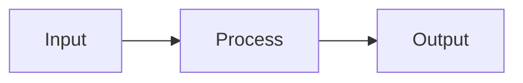
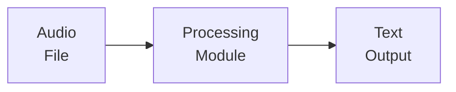
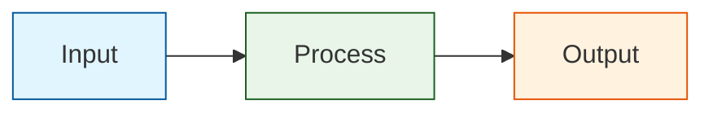

# Mermaid Test File

This file contains simple Mermaid diagrams to test GitHub compatibility.

## Simple Flow Test

## Test with Line Breaks

## Test with Multiple Modules

## Test with Colors

This test file ensures that:
- Basic Mermaid syntax works
- Line breaks with ` ` work correctly
- Multiple connected nodes work
- CSS classes and colors work
- No `direction TB` is used in subgraphs