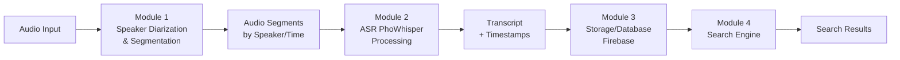

# Audio Processing Pipeline Documentation

## Overview

This document describes the complete audio processing pipeline for speech recognition and analysis. The pipeline consists of 4 main modules that work together to process audio files, perform speaker diarization, transcribe speech, store results, and enable search functionality.

## Pipeline Flow

```
Audio Input → Module 1 → Audio Segments → Module 2 → Transcript + Database → Module 4 (Search)
```

## Architecture Diagrams

### Simple Pipeline Diagram



### Detailed Pipeline Diagram (Colored)

```mermaid
graph LR
    A[Audio Input<br/>WAV/MP3/M4A] --> M1[Module 1<br/>Speaker Diarization<br/>& Segmentation]
    
    M1 --> P1[Load Audio +<br/>Speaker Samples]
    P1 --> P2[pyannote/speaker-<br/>diarization-3.1]
    P2 --> P3[pyannote/embedding<br/>+ Cosine Similarity]
    P3 --> P4[Silence Detection<br/>pydub]
    P4 --> P5[Cut Segments by<br/>Speaker/Time]
    
    P5 --> S[Audio Segments<br/>Tagged by Speaker]
    
    S --> M2[Module 2<br/>ASR PhoWhisper]
    M2 --> A1[Preprocessing<br/>16kHz, Mono, Normalize]
    A1 --> A2[Feature Extraction<br/>Log-Mel Spectrograms]
    A2 --> A3[ASR Model<br/>vinai/PhoWhisper-large<br/>FP16, Chunk 20s, Batch 2]
    A3 --> A4[Postprocessing<br/>Merge Segments<br/>Add Speaker Tags<br/>+ Timestamps]
    A4 --> A5[Add Punctuation<br/>Save transcript.txt]
    
    A5 --> T[Transcript with<br/>Speaker Labels<br/>+ Timestamps]
    
    T --> M3[Module 3<br/>Storage/Database<br/>Firebase]
    M3 --> D1[Store Transcripts]
    D1 --> D2[Index for Search]
    
    D2 --> M4[Module 4<br/>Search Engine]
    M4 --> S1[Query Processing]
    S1 --> S2[Search Algorithm]
    S2 --> R[Search Results<br/>with Context]
    
    classDef inputOutput fill:#e1f5fe,stroke:#01579b,color:#000
    classDef module fill:#f3e5f5,stroke:#4a148c,color:#000
    classDef process fill:#e8f5e8,stroke:#1b5e20,color:#000
    classDef storage fill:#fff3e0,stroke:#e65100,color:#000
    classDef search fill:#fce4ec,stroke:#880e4f,color:#000
    
    class A,R inputOutput
    class M1,M2,M3,M4 module  
    class P1,P2,P3,P4,P5,A1,A2,A3,A4,A5 process
    class S,T,D1,D2 storage
    class S1,S2 search
```

## Module Descriptions

### Module 1: Speaker Diarization & Segmentation

**Purpose**: Identify different speakers in audio and segment the audio by speaker and time.

**Components**:
- **Audio Loading**: Load audio files and speaker sample references
- **Speaker Diarization**: Uses `pyannote/speaker-diarization-3.1` for speaker identification
- **Speaker Embedding**: Uses `pyannote/embedding` with cosine similarity for speaker matching
- **Silence Detection**: Uses `pydub` library to detect speech ranges and remove silence
- **Segmentation**: Cuts audio into segments based on speaker changes and time boundaries

**Input**: Raw audio files (WAV, MP3, M4A)
**Output**: Audio segments tagged with speaker IDs and timestamps

### Module 2: ASR (PhoWhisper)

**Purpose**: Convert speech segments to text using Vietnamese-optimized speech recognition.

**Components**:

1. **Preprocessing**:
   - Resample audio to 16kHz
   - Convert to mono channel
   - Normalize audio levels

2. **Feature Extraction**:
   - Generate log-Mel spectrograms from audio
   - Prepare features for ASR model

3. **ASR Model**:
   - Model: `vinai/PhoWhisper-large`
   - Precision: FP16 for efficiency
   - Processing: 20-second chunks with batch size 2
   - Optimized for Vietnamese speech

4. **Postprocessing**:
   - Merge transcribed segments
   - Add speaker tags and timestamps
   - Apply punctuation rules
   - Save to `transcript.txt` file

**Input**: Audio segments from Module 1
**Output**: Timestamped transcripts with speaker labels

### Module 3: Storage/Data Processing

**Purpose**: Store processed transcripts and prepare them for search functionality.

**Components**:
- **Database Storage**: Firebase/Database integration for persistent storage
- **Data Indexing**: Create search indices for efficient querying
- **Metadata Management**: Store audio metadata, processing timestamps, and speaker information

**Input**: Transcripts with metadata from Module 2
**Output**: Indexed database records ready for search

### Module 4: Search

**Purpose**: Enable searching through stored transcripts with contextual results.

**Components**:
- **Query Processing**: Parse and normalize search queries
- **Search Algorithm**: Full-text search with ranking
- **Result Formatting**: Return relevant transcript segments with context

**Input**: Search queries from users
**Output**: Ranked search results with transcript snippets and timestamps

## Technical Notes

### Smart Memory Management

The pipeline implements smart cleanup procedures to manage memory efficiently:

```python
# Smart cleanup after processing
torch.cuda.empty_cache()  # Clear CUDA memory cache
gc.collect()              # Force garbage collection
```

**When to use**:
- After processing each audio file
- After loading/unloading models
- During batch processing between batches
- When switching between modules

### Performance Optimizations

- **Batch Processing**: ASR processes multiple segments simultaneously (batch size 2)
- **FP16 Precision**: Reduces memory usage while maintaining accuracy
- **Chunking**: 20-second chunks prevent memory overflow for long audio files
- **Caching**: Model weights cached to avoid reloading

### Error Handling

Each module includes robust error handling for:
- Corrupted or unsupported audio files
- Network connectivity issues (Firebase)
- Model loading failures
- Memory allocation errors

## Usage Examples

### Basic Pipeline Execution

```python
# Example workflow
audio_file = "recording.wav"
speaker_samples = ["speaker1.wav", "speaker2.wav"]

# Module 1: Diarization
segments = diarization_module.process(audio_file, speaker_samples)

# Module 2: ASR
transcripts = asr_module.transcribe(segments)

# Module 3: Storage
storage_module.save(transcripts)

# Module 4: Search
results = search_module.query("specific keyword")
```

### Memory Management Best Practices

```python
# Proper cleanup between processing
def process_audio_batch(audio_files):
    for audio_file in audio_files:
        # Process file
        result = pipeline.process(audio_file)
        
        # Smart cleanup
        torch.cuda.empty_cache()
        gc.collect()
        
        yield result
```

## Dependencies

- **pyannote**: Speaker diarization and embedding
- **pydub**: Audio processing and silence detection
- **torch**: Deep learning framework
- **transformers**: For PhoWhisper model
- **firebase**: Database and storage
- **numpy**: Numerical operations
- **librosa**: Audio feature extraction

## Configuration

The pipeline can be configured for different use cases:
- Batch sizes for memory optimization
- Chunk durations for different audio lengths
- Speaker similarity thresholds
- Search result ranking parameters